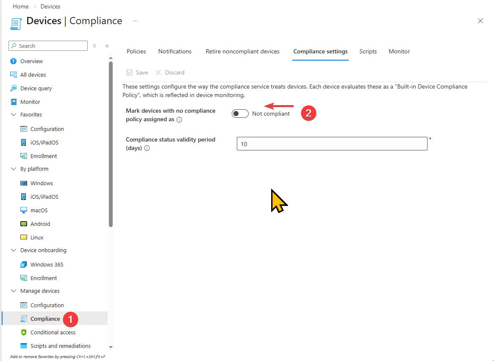

*This is Part 1 of a 5-part series on designing Microsoft Intune compliance policies for enterprise environments.*

---

Every Zero Trust architecture needs a way to answer one question at the point of access: **"Is this device trustworthy?"** In the Microsoft ecosystem, that answer comes from Intune compliance policies. They're the evaluation engine that determines whether a device meets your organization's security requirements — and that binary compliant/noncompliant signal is what Conditional Access uses to grant or deny access to corporate resources.

In this opening post, I'll break down what compliance policies actually are, how they differ from configuration profiles, how the evaluation engine works under the hood, and the critical global settings that every Intune administrator needs to configure on day one.

## What compliance policies actually do

There's a common misconception that compliance policies *enforce* settings on devices. They don't. **Compliance policies evaluate device state and report a status.** They're auditors, not enforcers.

The enforcer role belongs to **configuration profiles**, which push settings like BitLocker encryption, firewall rules, or password requirements to devices. Compliance policies then check whether those settings are actually in place and working. This separation is intentional and important — it means you can check for a setting without managing it, and you can manage a setting without gating access on it.

Here's the practical distinction:

- **Configuration profile**: "Enable BitLocker with XTS-AES 256-bit encryption on the OS drive"
- **Compliance policy**: "Is BitLocker currently enabled on this device?"
- **Conditional Access**: "Only allow access to Exchange Online from devices where the answer to the above is yes"

These three layers work together, but they're configured independently. One of the most common deployment mistakes — which I'll cover in detail in Part 5 — is creating compliance checks for settings that were never deployed via configuration profile, causing mass noncompliance across your fleet.

## How the evaluation engine works

Compliance evaluation runs on a scheduled cycle. Understanding that cycle is critical for troubleshooting and for setting realistic expectations with stakeholders about how quickly device status changes propagate.

**Check-in frequency** varies by lifecycle stage. Newly enrolled devices check in aggressively — every few minutes initially — then taper off. Established devices settle into a **maintenance sync approximately every 8 hours**. Intune enforces a 30-minute throttle between push notifications per device and allows only one maintenance sync every 6.5 hours.

The evaluation cycle triggers on several events: new enrollment, periodic sync, policy assignment changes, new compliance information detected during sync, and user-initiated checks through the Company Portal app. When an administrator modifies a compliance policy, Intune sends push notifications via WNS (Windows) or APNs (Apple) to prompt devices to check in within minutes rather than waiting for the next scheduled cycle.

**Grace periods** are independent from check-in schedules and are configured per-action in each compliance policy. The "Mark device noncompliant" action defaults to 0 days (immediate), but can be configured from 1 to 365 days. During a grace period, the device enters an **InGracePeriod** state. It's technically noncompliant, but Conditional Access treats it as compliant. Once the grace period expires, the device transitions to full NonCompliant status and Conditional Access enforcement kicks in.

This grace period mechanism is essential for settings like BitLocker, Secure Boot, and Code Integrity that rely on **Device Health Attestation (DHA)**. DHA measurements only occur at boot time, meaning a freshly enrolled device may not report compliant until after its first reboot. Setting a 0-day grace period for these settings causes false noncompliance during enrollment — a common gotcha I see in almost every assessment.

## The two global settings you must change

Intune has two tenant-wide compliance settings that are easy to overlook and critically important to configure correctly.

### "Mark devices with no compliance policy assigned as..."

This setting defaults to **Compliant**. Read that again — by default, any device that has no compliance policy assigned is considered compliant. If you have Conditional Access policies that require device compliance, unmanaged or unassigned devices pass right through.

**Change this to Not Compliant.** Microsoft explicitly recommends this. It ensures that only devices that have been explicitly evaluated and passed compliance checks can access protected resources. Without this change, you have a security gap that undermines your entire compliance architecture.

### Compliance status validity period

This setting determines how long a device can go without checking in before it's marked noncompliant. The default is **30 days**, configurable from 1 to 120 days. If a device fails to report its compliance status within this window, Intune marks it noncompliant regardless of its last-known state.

For most organizations, the default 30 days is reasonable. High-security environments may want to reduce this to 7-14 days. Be cautious about setting it too low — devices that are legitimately offline (field laptops, seasonal workers) will lose compliance status and require re-evaluation on their next check-in.

## How conflict resolution works

When multiple compliance policies target the same device — which is common in enterprises with department-specific or role-based policies — Intune uses a **most restrictive wins** model at the individual setting level.

Each setting is evaluated independently. If Policy A requires a 6-character password and Policy B requires an 8-character password, the device must meet the 8-character requirement. This applies across all settings in all assigned policies. Compliance policy settings also [take precedence over configuration profile settings](https://learn.microsoft.com/en-us/intune/intune-service/configuration/device-profile-troubleshoot#compliance-and-device-configuration-policies-that-conflict) when they overlap, even when the configuration profile is more restrictive.

This means you can safely layer compliance policies without worrying about conflicts causing unpredictable behavior. A baseline compliance policy for all devices can coexist with a stricter policy for finance department devices, and the device will simply be held to the more restrictive standard for each individual setting.

## Where compliance fits in the bigger picture

Compliance policies sit at the intersection of three pillars in the Microsoft security stack:

1. **Device management** (Intune configuration profiles push the desired state)
2. **Device evaluation** (Intune compliance policies verify the actual state)
3. **Access control** (Conditional Access enforces based on the evaluated state)

In Microsoft's Zero Trust deployment model, compliance policies are specifically Layer 3 of a seven-layer device security model. They follow app protection policies (Layer 1) and enrollment (Layer 2), and they feed directly into Conditional Access (Layer 4) as a trust signal. The compliance binary implements the Zero Trust principle of "verify explicitly" for every resource access request.

The full seven layers — app protection, enrollment, compliance, Conditional Access, threat defense, identity protection, and information protection — are covered in [Microsoft's Zero Trust documentation](https://learn.microsoft.com/en-us/security/zero-trust/deploy/overview). Each layer builds on the previous one; gaps at the compliance layer ripple up through access control and beyond.

## What's next

In Part 2, I'll dive deep into platform-specific compliance settings across all five supported operating systems — Windows, macOS, iOS/iPadOS, Android Enterprise, and Linux. Each platform has a fundamentally different compliance surface area, and understanding what you can and can't check on each platform is essential for designing effective policies.
