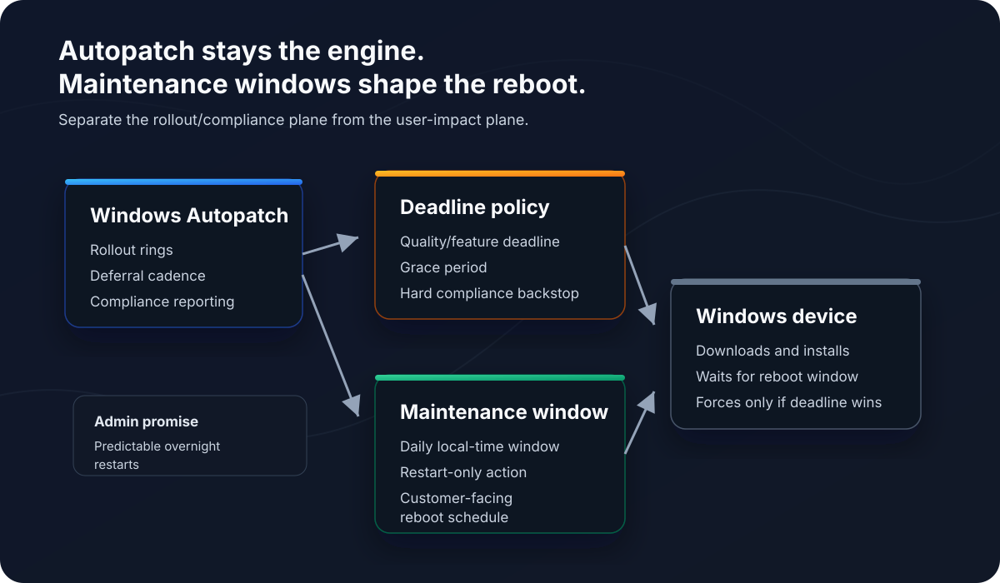
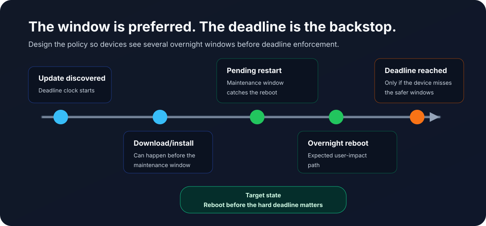
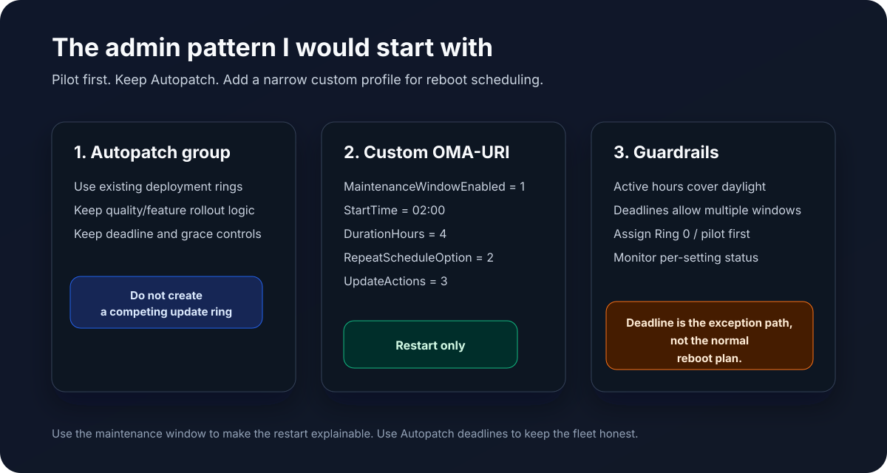

*Disclosure: This post was drafted with AI assistance and edited by a human.*

Windows Autopatch is good at the part most administrators want Microsoft to own: update orchestration, ring-based rollout, deferrals, reporting, and compliance pressure. Where it still gets uncomfortable is the customer conversation around reboots.

It is one thing to say, "Autopatch will keep your devices compliant." It is another thing to say, "Your devices should only automatically reboot during this overnight window."

That second sentence is the operational promise administrators are usually asked to make.

The interesting new piece is the Windows Update maintenance window policy family. Microsoft documents these as native Windows 11 policies that let you define when selected update actions are allowed to start. The feature is very new, and at the time I am writing this, I would treat it as something to pilot carefully instead of turning on tenant-wide.

The core thesis:

**Windows Autopatch should remain the compliance and rollout engine, while Windows Update maintenance windows become the operational reboot schedule. The value is not replacing Autopatch. The value is making restart behavior more predictable for admins and customers.**



## The problem I am trying to solve

Autopatch can manage update rollout well, but reboot predictability is still where users and customers feel the pain. Admins need a pattern that gives them both of these outcomes:

- Keep a compliance backstop so devices cannot drift indefinitely.
- Avoid automatic daytime reboots as the normal operating behavior.

If you solve only for compliance, the device eventually restarts when Windows Update enforcement wins. That may be technically correct, but it is not always operationally graceful.

If you solve only for a soft reboot window and remove deadline pressure, you risk devices sitting in a pending restart state for too long.

The goal is to make the maintenance window the normal path and the deadline the exception path.

## What maintenance windows control

Microsoft's maintenance window documentation says the feature is intended to make update actions take place during configured hours, keep devices available at other times, and keep devices updated more consistently. Microsoft also states that maintenance window times use the local time of the device.

The important detail is that maintenance windows do not have to control every update action. The `MaintenanceWindowUpdateActions` policy lets you choose which actions must start inside the window:

- `1` = Download, install and restart
- `2` = Install and restart
- `3` = Restart only

For my use case, `3` is the interesting value.

With **Restart only**, Windows can still download and install updates before the maintenance window. That is useful because it gives the device time to prepare the update payload. The disruptive action - the restart/apply phase - is what gets reserved for the maintenance window.

That is the pattern I want for customer-facing Windows endpoints. I do not want to slow down every part of the update process. I want the reboot to become predictable.

## How this fits with Autopatch

Autopatch groups and update rings are still the place to manage rollout cadence. Microsoft documents Autopatch groups as using deployment rings for gradual rollout, and Autopatch-created update ring policies configure important update settings such as automatic update behavior, deferrals, deadlines, and grace periods.

Maintenance windows sit beside that, not in place of it.

In plain English:

- Autopatch decides which devices get updates and when.
- Update ring deadline settings decide how long devices can defer update completion.
- Maintenance window CSP settings define the preferred automatic restart window.
- Active hours remain a daytime user-experience guardrail.



The deadline matters because it is the hard stop. Microsoft's deadline documentation explains that once a restart is still pending after the deadline passes, Windows forces a restart to keep the device compliant. That is why I would never describe maintenance windows as a perfect guarantee that no reboot can ever happen elsewhere.

The better promise is this:

**For healthy, online devices, automatic update restarts are designed to occur during the configured maintenance window. If the device repeatedly misses that window or reaches the compliance deadline, Windows can still enforce the restart.**

That is honest, and it is much easier to operate.

## The Intune policy shape

Because this policy family is still new, I am using a custom Intune configuration profile instead of assuming it will always be available in Settings Catalog.

Create a profile like this:

```text
Platform: Windows 10 and later
Profile type: Templates
Template name: Custom
Name: Windows Update Maintenance Window - Pilot
```

Then add these OMA-URI settings:

| Name | OMA-URI | Data type | Example value |
| --- | --- | --- | --- |
| Enable maintenance window | `./Device/Vendor/MSFT/Policy/Config/Update/MaintenanceWindowEnabled` | Integer | `1` |
| Start time | `./Device/Vendor/MSFT/Policy/Config/Update/MaintenanceWindowStartTime` | String | `02:00` |
| Duration hours | `./Device/Vendor/MSFT/Policy/Config/Update/MaintenanceWindowDurationHours` | Integer | `4` |
| Repeat daily | `./Device/Vendor/MSFT/Policy/Config/Update/MaintenanceWindowRepeatScheduleOption` | Integer | `2` |
| Restart only | `./Device/Vendor/MSFT/Policy/Config/Update/MaintenanceWindowUpdateActions` | Integer | `3` |

That example creates a daily local-device-time maintenance window from 2:00 AM to 6:00 AM and restricts automatic update restarts to that window.

Microsoft's Update Policy CSP reference currently lists the maintenance window settings as applicable to Windows 11, version 24H2 with KB5077181 / build `10.0.26100.7840` and later. Check that requirement before assigning the policy broadly.

## Why I prefer restart-only

There are three possible patterns:

| Pattern | What it does | Where I would use it |
| --- | --- | --- |
| Download, install, and restart | Everything starts only inside the window | Kiosks or devices with very predictable offline time |
| Install and restart | Download can happen earlier, install/restart waits | More controlled devices where install impact matters |
| Restart only | Download/install can happen earlier, restart waits | Most user devices where the reboot is the main disruption |

For Autopatch-managed user devices, I prefer **Restart only**.

It gives Windows Update more room to do the non-disruptive work before the window opens. Then, when the window arrives, the device is more likely to be ready for the one action users actually notice.

## Deadline settings still need care

The maintenance window is not a reason to make deadlines aggressive. In fact, the opposite is true.

If you promise customers that update reboots should happen overnight, the deadline and grace period need to allow enough time for devices to see multiple overnight windows before enforcement.

For quality updates, I would start with something like this for many business endpoints:

```text
Quality update deadline: 7-10 days
Grace period: 2-3 days
Auto reboot before deadline: Yes
Active hours: Daytime business hours
```

The exact numbers depend on the customer and risk tolerance. The principle is more important than the example: **do not design the policy so the deadline is the first realistic reboot opportunity.**

The Intune update ring documentation also calls out a subtle but important behavior: setting auto reboot before deadline to `No` can force the system to wait until the deadline and grace period expire, and that restart could occur during active hours. For this design, I want Windows to take safe opportunities before the hard stop.

## Active hours still matter

I would still configure active hours to cover the normal workday. Active hours are not the main scheduling mechanism in this design, but they remain a useful guardrail for automatic restarts.

For example:

```text
Active hours start: 06:00
Active hours end: 22:00
Maintenance window: 02:00-06:00
```

Avoid overlap between active hours and the maintenance window. If active hours are supposed to protect daytime work and the maintenance window is supposed to catch overnight reboots, make that relationship obvious in the policy.

## The admin pattern I would deploy



My starting pattern looks like this:

1. Keep Windows Autopatch enabled for the device population.
2. Do not create a separate competing update ring for the same Autopatch-managed devices.
3. Create a dedicated custom configuration profile for maintenance windows.
4. Assign it to a small pilot group first, ideally Ring 0 or another controlled validation set.
5. Use a daily overnight local-time maintenance window.
6. Set `MaintenanceWindowUpdateActions` to `3` for restart-only behavior.
7. Keep deadline and grace settings long enough for devices to pass through multiple windows before enforcement.
8. Watch per-setting status and device behavior before broad assignment.

The policy is small on purpose. Autopatch remains the update service model. The custom profile only adds the reboot scheduling intent that Autopatch does not fully express by itself.

## Caveats I would tell every admin

There are several caveats worth being clear about:

- This is new. Test it before broad deployment.
- The documented OS requirement matters.
- Devices need to be online and healthy during the window.
- Maintenance windows control automatic scheduling. Users can still manually restart.
- Actions that start inside a window can continue until completion outside the window.
- If deadline enforcement wins, Windows can still force the restart.
- Active hours and maintenance windows should not conflict.
- Update removal and some other administrative actions may not behave like normal update installation.

I would also be careful with the word "guarantee." This is a better reboot operating model, not a magic shield against every possible restart scenario.

## How I would explain it to a customer

The customer-facing version is simple:

> Windows Autopatch continues to keep devices secure and compliant. We are adding a Windows Update maintenance window so automatic update restarts are scheduled for the approved overnight window in the device's local time. If a device repeatedly misses that window or reaches the update deadline, Windows may still enforce a restart to protect compliance.

That is the balance I want: predictable reboots without giving up the security backstop.

## References

- [Policy CSP - Update: Maintenance Window](https://learn.microsoft.com/en-us/windows/client-management/mdm/policy-csp-update#maintenance-window)
- [Enforce compliance deadlines with policies](https://learn.microsoft.com/en-us/windows/deployment/update/wufb-compliancedeadlines)
- [Intune update ring policy settings](https://learn.microsoft.com/en-us/intune/device-updates/windows/ref-update-ring-settings)
- [Windows Autopatch groups overview](https://learn.microsoft.com/en-us/windows/deployment/windows-autopatch/deploy/windows-autopatch-groups-overview)
- [Autopatch group policies](https://learn.microsoft.com/en-us/windows/deployment/windows-autopatch/manage/windows-autopatch-groups-policies)
