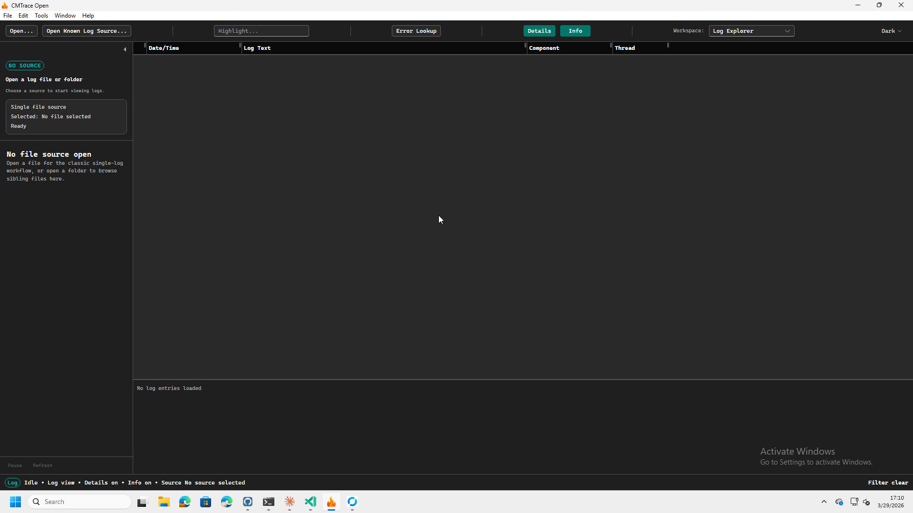
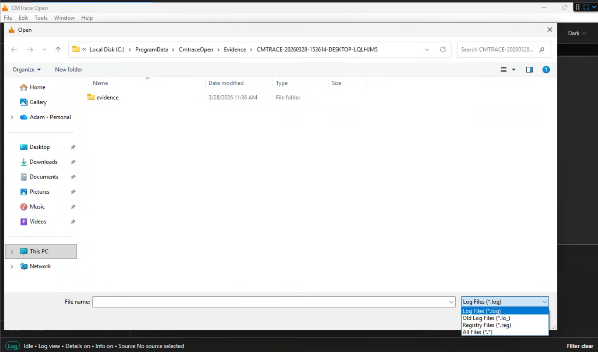
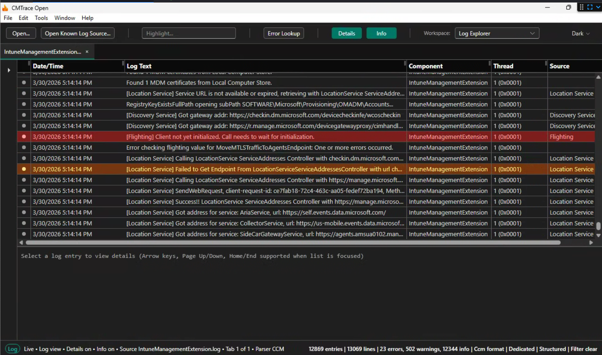
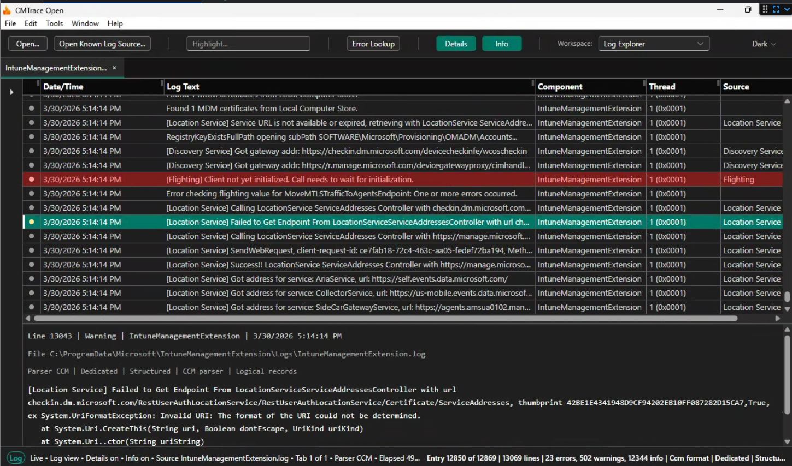
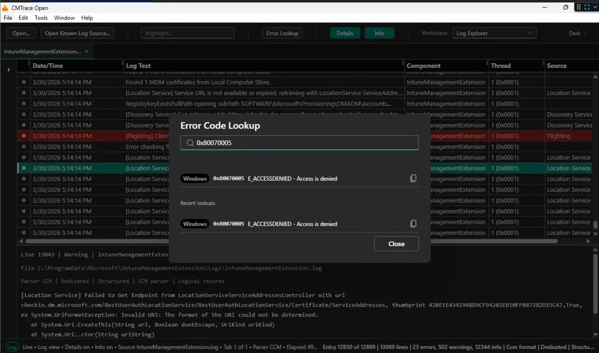
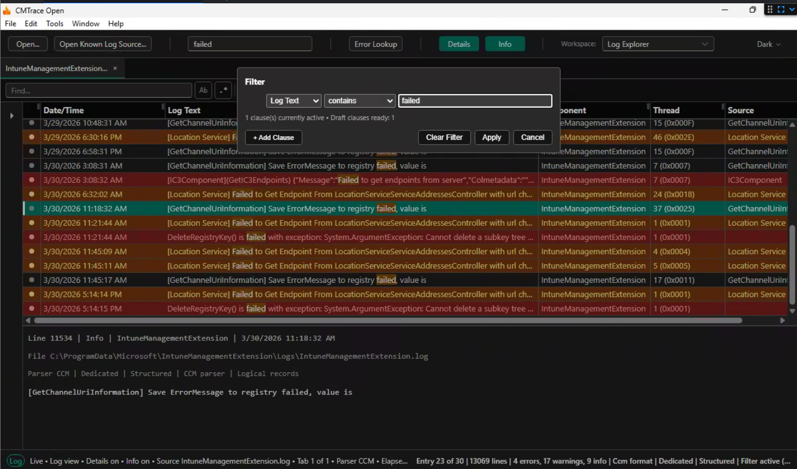
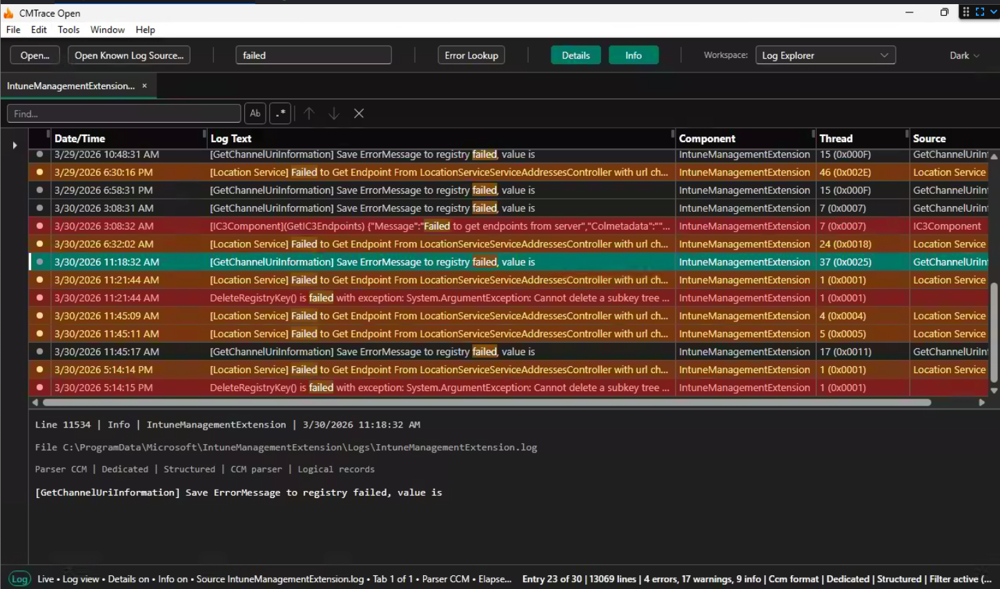
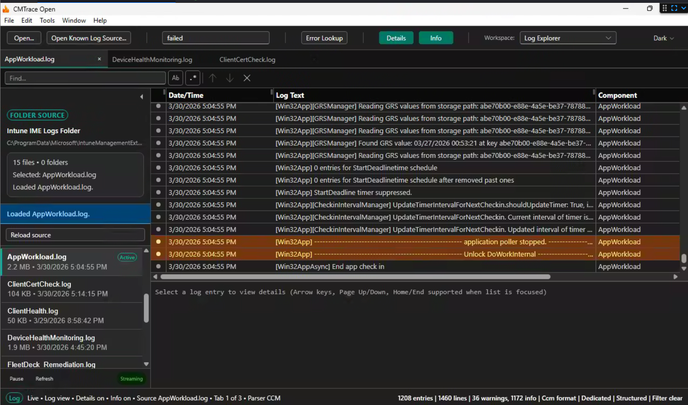

This is the quick start. By the end of this post you'll have CMTrace Open installed, a log file open, and your first error code decoded. No fluff, just the steps.

## Download and Install

Head to the [GitHub releases page](https://github.com/adamgell/cmtraceopen/releases) and grab the latest version. MSI for Windows, DMG for macOS.

Install it like any other app. On Windows, double-click the MSI and click through. On macOS, drag to Applications.

When you first launch it, you'll see a clean workspace. Toolbar across the top, sidebar on the left, empty log area in the center.



## Open a Log File

Hit `Ctrl+O` (or File > Open File). The file dialog shows filters for `.log`, `.lo_`, `.reg`, and all files.



Navigate to a log you want to look at. For this walkthrough, let's use an Intune IME log:

```
C:\ProgramData\Microsoft\IntuneManagementExtension\Logs\IntuneManagementExtension.log
```

Or skip the manual navigation entirely. Go to File > Known Log Sources > Windows Intune > Intune IME > Intune IME Logs Folder. One click, no path to remember. We'll cover Known Log Sources in detail in a later post.

## Reading the Log

Once the file loads, CMTrace Open auto-detects the format. For an IME log, that's CCM format. You'll see columns for Date/Time, Log Text, Component, and Thread.



Notice the colored dots on the left side of each row. Red means error. Yellow means warning. Gray is informational. You can spot problems at a glance without reading every line.

Click any row to see its full details in the pane on the right side. This shows the complete entry with all fields expanded.



## Find Something

Press `Ctrl+F` to open the find bar at the bottom of the screen. Type `error` and hit Enter.

`[Screenshot: find bar open with "error" typed, showing match count]`

The match count shows right away. Something like "14 of 247 matches." Press `F3` to jump to the next match. `Shift+F3` goes back. Every match is highlighted across all rows so you can see the pattern.

The find bar supports plain text and regex. Toggle regex mode with the button on the right side of the bar. If your regex has a typo, the bar turns red to let you know.

## Look Up an Error Code

This is the feature that saves the most time. Say you find a row with `0x80070005` in the message.

Press `Ctrl+E` to open the Error Lookup dialog. Type `0x80070005`.



Instantly you get: **E_ACCESSDENIED: Access is denied.** Category: Windows.

No browser tab. No Google search. No guessing. The database has 739 error codes across 15 categories. It handles hex codes, decimal codes, and even does HRESULT decomposition when a code isn't in the main database.

## Filter the Log

Sometimes searching isn't enough. You want to hide everything except the rows that matter. Press `Ctrl+L` to open the Filter dialog.



Add a clause: LogText equals Error. Click Apply. Now only error rows show up. Everything else is hidden.



You can stack clauses. Add a second one: Message contains "install". Now you see only install-related errors. The filter supports AND/OR logic, regex matching, and date/time ranges.

To clear the filter and see everything again, open the filter dialog and remove the clauses.

## Real-Time Tailing

Open a log file that's being actively written to. New entries show up at the bottom in real time as they're written to disk.

Press `Ctrl+U` to pause. The status bar shows "Paused" and entries stop scrolling. This is useful when you need to read something without it moving on you. Press `Ctrl+U` again to resume. Any entries that came in while paused will appear.

Filters work during tailing too. Set a filter for Severity = Error and only errors show up as they happen. Great for watching a deployment or sync in progress.

## Open a Folder

Instead of one file at a time, you can open an entire folder. File > Open Folder, or use Known Log Sources to open a preset folder like the IME Logs Folder.



The sidebar shows every log file in the folder. Each file opens as a tab. Click between tabs to switch. Switching is instant because parsed entries are cached in memory. No re-parsing.

This is how you investigate a problem that spans multiple log files. Open the folder, check `IntuneManagementExtension.log` for the error, then switch to `AppWorkload.log` to see the download details. Same error, different perspectives.

## Keyboard Shortcuts

Here's the full list. These match the original CMTrace where possible.

| Shortcut | Action |
|----------|--------|
| `Ctrl+O` | Open file |
| `Ctrl+F` | Find |
| `F3` / `Shift+F3` | Next / Previous match |
| `Ctrl+L` | Filter |
| `Ctrl+E` | Error lookup |
| `Ctrl+U` | Pause/Resume tail |
| `Ctrl+H` | Toggle details pane |
| `Ctrl+B` | Toggle sidebar |
| `Ctrl+C` | Copy selected entry |
| `Ctrl+=` / `Ctrl+-` / `Ctrl+0` | Zoom in / out / reset |
| `F5` | Refresh |
| `Escape` | Close dialog or find bar |

That's 13 shortcuts. That's all you need to be fast.

<!--
## What's Next

Now that you know the basics, the next posts in this series cover:

- [Log Formats: How Auto-Detection Works](/tools/cmtrace/log-formats-how-auto-detection-works) - what happens when you open different types of logs
- [Known Log Sources: Stop Hunting for File Paths](/tools/cmtrace/known-log-sources) - the full catalog of preset sources
- [Real-Time Tailing: Watch Logs as They Happen](/tools/cmtrace/real-time-tailing) - live troubleshooting workflows
-->
